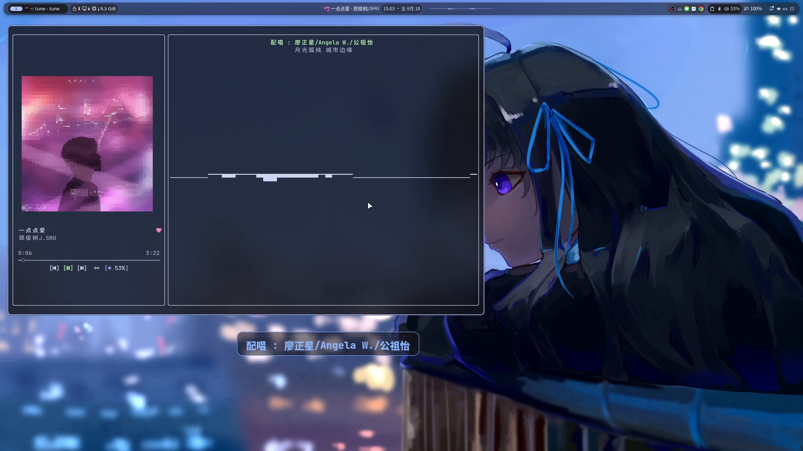

<div align="center">

# 󰎆 tune

<p align="center">
  <strong>现代 · 极简 · 高性能的网易云音乐终端 (TUI) 播放器</strong>
</p>

<p align="center">
  <a href="https://github.com/aimy1/tune/blob/main/LICENSE"></a>
  <a href="https://github.com/aimy1/tune/releases"></a>
  
  
  
  
</p>

<p align="center">
  <a href="#-功能演示">功能演示</a> •
  <a href="#-特性亮点">特性亮点</a> •
  <a href="#-桌面歌词">桌面歌词</a> •
  <a href="#-快速开始">快速开始</a> •
  <a href="#-快捷键指南">快捷键</a> •
  <a href="#-配置与主题">配置</a> •
  <a href="#-开源协议">开源协议</a>
</p>

</div>

---

`tune` 是一款专为终端极客与音乐爱好者打造的网易云音乐终端播放器。基于 **Rust** 与 **Ratatui** 异步渲染引擎构建，追求极致轻量、亚毫秒级输入响应，融入 **Catppuccin** 全色系主题、**Kitty / Sixel** 高清封面渲染、**跨屏拖拽悬浮桌面歌词** 以及沉浸式全屏微动效，让终端听歌体验兼具极客速度与现代美学。

---

## 🎬 功能演示

<div align="center">
  <video controls width="100%" poster="assets/preview.png">
    <source src="https://github.com/aimy1/tune/raw/main/exhibit.mp4" type="video/mp4">
    <source src="exhibit.mp4" type="video/mp4">
    <a href="https://github.com/aimy1/tune/blob/main/exhibit.mp4">
      
    </a>
  </video>
  <p align="center">
    <em>▶️ 点击上方视频播放，或 <a href="https://github.com/aimy1/tune/blob/main/exhibit.mp4"><strong>在此处在线观看完整高清展示视频 (exhibit.mp4)</strong></a></em>
  </p>
</div>

---

## ✨ 特性亮点

| 模块 | 特性说明 |
| :--- | :--- |
| 🎨 **设计美学** | 原生搭载 **Catppuccin** 官方四色系（Mocha、Macchiato、Frappe、Latte）与 Hyprland 配色；支持背景透明化，与终端壁纸自然融为一体。 |
| 🪟 **桌面歌词** | 独立的现代化透明置顶悬浮歌词客户端（支持 Wayland Layer Shell / X11）；支持跨屏幕平滑拖动与实时坐标回显、拖拽高亮边框；支持宽度、透明度、字号、单双行、对齐方式等多维度个性化定制。 |
| 🖼️ **高清封面** | 基于 `ratatui-image` 支持 Kitty 与 Sixel 图形协议，终端内无损直出超清专辑封面；不支持图形协议的终端智能优雅降级为高精度 Braille / ASCII 字符画。 |
| 🎛️ **全屏沉浸** | 双栏沉浸式播放视窗；现代化极简居中“关于”与“设置”弹窗（优雅圆角边框、动态真彩渐变 Logo）；**单行极简悬浮音量胶囊**（不遮挡进度条，支持滚轮/点击无级调节）；十段图形均衡器（EQ）；平滑滚动的实时卡拉 OK 歌词。 |
| ⚡ **极速性能** | 纯异步 Tokio 事件驱动，内存开销仅数十兆，启动瞬时秒开，无任何 Electron 或 Webview 臃肿负担。 |
| 🎧 **高质音源** | 支持网易云从标准 MP3 至无损 FLAC、Hi-Res、超清母带等全部音质；支持 AcoustID 音频指纹识别与离线歌词匹配。 |
| 🔌 **桌面集成** | Linux 桌面 **MPRIS** 协议深度集成，支持媒体快捷按键、D-Bus 系统总线控制与桌面切歌通知。 |

---

## 🪟 桌面歌词

`tune` 内置了独立高性能的悬浮桌面歌词客户端，带来媲美甚至超越原生图形播放器的歌词悬浮体验：

- **Wayland / X11 原生支持**：在 Wayland 下基于 `gtk-layer-shell` 实现真正的桌面顶层透明浮动（支持 Hyprland、Sway、Wayfire 等合成器），在 X11 下亦能完美置顶显示。
- **跨屏幕拖动与实时坐标反馈**：按住顶部把手即可在多显示器之间自由拖动，拖动时自动显示高亮反馈边框，并实时回显当前光标所在显示器名称与绝对坐标（如 `⠿ DP-2 [1280, 1350]`）。
- **个性化深度定制**（通过系统设置菜单 <kbd>,</kbd> 直达）：
  - **窗口宽度**：紧凑 (560px) / 标准 (760px) / 宽屏 (960px) / 超宽 (1200px)，超长歌词自适应展开不截断；
  - **背景透明度**：100% / 85% / 70% / 50% / 30% 五档精细调节；
  - **字体大小**：16px / 18px / 20px / 24px / 28px / 32px 动态缩放；
  - **单双行歌词**：自由切换主歌词与副歌词/翻译双行呈现或单行极简显示；
  - **歌词对齐**：支持居中 / 居左 / 居右对齐；
  - **背景样式**：经典半透 / 深色磨砂 / 轻薄高透 / 纯净无底色；
  - **锁定与记忆**：支持一键锁定（防误触并开启鼠标事件穿透）与一键恢复当前屏幕底部居中位置。
- **全局极速联动**：随时按快捷键 <kbd>d</kbd> 即可一键显示/隐藏桌面歌词。

---

## 🚀 快速开始

> [!TIP]
> 推荐终端使用支持 [Nerd Fonts](https://www.nerdfonts.com/) 图标集的等宽字体（如 *JetBrainsMono Nerd Font*、*FiraCode Nerd Font*），以获得最佳图标渲染效果。

### 1. 系统依赖安装

编译运行本项目需要音频开发库、D-Bus 消息总线库以及桌面歌词相关的基础依赖：

- **Arch Linux**:
  ```bash
  sudo pacman -S alsa-lib dbus pkgconf chromaprint python python-gobject gtk3 gtk-layer-shell
  ```

- **Fedora / RHEL**:
  ```bash
  sudo dnf install -y alsa-lib-devel dbus-devel pkgconf-pkg-config chromaprint-devel python3 python3-gobject gtk3 gtk-layer-shell
  ```

- **Ubuntu / Debian**:
  ```bash
  sudo apt-get update && sudo apt-get install -y libasound2-dev libdbus-1-dev pkg-config libchromaprint-dev python3 python3-gi python3-gi-cairo gir1.2-gtk-3.0 libgtk-layer-shell-dev
  ```

---

### 2. 构建与运行

确保已安装 [Rust](https://www.rust-lang.org/) 环境（推荐使用 Rust 2024 Edition / 1.85+）：

```bash
# 1. 克隆代码仓库
git clone https://github.com/aimy1/tune.git
cd tune

# 2. 进行 Release 优化编译
cargo build --release

# 3. 安装到用户可执行路径（可选）
install -m 755 target/release/tune ~/.local/bin/tune
```

安装完成后直接运行即可：
```bash
tune
```

---

## ⌨️ 快捷键指南

### 全局与导航
| 按键 | 功能描述 |
| :---: | :--- |
| <kbd>s</kbd> / <kbd>/</kbd> | 唤出全局搜索弹窗 |
| <kbd>,</kbd> | 打开系统设置与快捷键偏好菜单（支持 Vim 键位 `h`/`j`/`k`/`l` 导航、`Backspace` 返回） |
| <kbd>b</kbd> | 展开 / 折叠主页侧边栏 |
| <kbd>f</kbd> | 进入 / 退出沉浸式全屏播放模式 |
| <kbd>d</kbd> | 快捷开启 / 关闭悬浮桌面歌词 |
| <kbd>x</kbd> | 快速返回主页（首页推荐） |
| <kbd>q</kbd> / <kbd>Ctrl+C</kbd> | 退出播放器 |

### 播放与控制
| 按键 | 功能描述 |
| :---: | :--- |
| <kbd>Space</kbd> | 播放 / 暂停当前曲目 |
| <kbd>Enter</kbd> | 播放选中歌曲、进入歌单、确认选中项 |
| <kbd>Esc</kbd> | 返回上一级 / 关闭当前弹出浮层 |
| <kbd>←</kbd> / <kbd>→</kbd> | 后退 / 快进播放进度 |
| <kbd>↑</kbd> / <kbd>↓</kbd> | 在曲目列表、推荐卡片或菜单间移动焦点 |
| <kbd>Ctrl+↑</kbd> / <kbd>Ctrl+↓</kbd> | 侧边栏“创建歌单”与“收藏歌单”分区快捷跳转 |

### 全屏模式专属控制
| 按键 | 功能描述 |
| :---: | :--- |
| <kbd>t</kbd> | 快速打开 / 关闭全屏设置面板 |
| <kbd>e</kbd> | 打开 / 关闭十段图形均衡器 (EQ) 调节窗口 |
| <kbd>v</kbd> | 呼出单行极简音量调节胶囊条（支持滚轮/方向键微调） |
| <kbd>l</kbd> | 喜欢 / 取消喜欢当前播放歌曲（红心联动） |
| <kbd>p</kbd> | 展开 / 关闭右侧播放队列列表 |
| <kbd>m</kbd> | 切换循环模式（顺序播放 / 随机播放 / 列表循环 / 单曲循环） |

---

## ⚙️ 配置与主题

首次运行后，`tune` 将在本地生成标准化 TOML 配置文件：

- **主配置文件**：`~/.config/tune/config/default.toml`
- **预设主题**：`~/.config/tune/themes/`
  - `catppuccin_mocha.toml`（默认深色调）
  - `catppuccin_macchiato.toml`
  - `catppuccin_frappe.toml`
  - `catppuccin_latte.toml`（清爽浅色调）
  - `hyprland.toml`
  - `system.toml`（系统终端原生配色）

在 `default.toml` 中配置 `theme = "mocha"` 即可快速切换主题风格，所有关于桌面歌词、音频指纹、界面对齐等偏好设置也会自动持久化保存于此。

---

## 👏 特别致谢

*   **架构与灵感**：感谢 [@professor-lee](https://github.com/professor-lee) 的开源贡献与底层架构灵感。
*   **渲染引擎**：感谢 [Ratatui](https://github.com/ratatui/ratatui) 团队卓越的终端 UI 开发生态。

---

## 📄 开源协议

本项目基于 [MIT License](LICENSE) 协议开源。欢迎提交 Issue 反馈建议或发起 Pull Request 共同改进！
